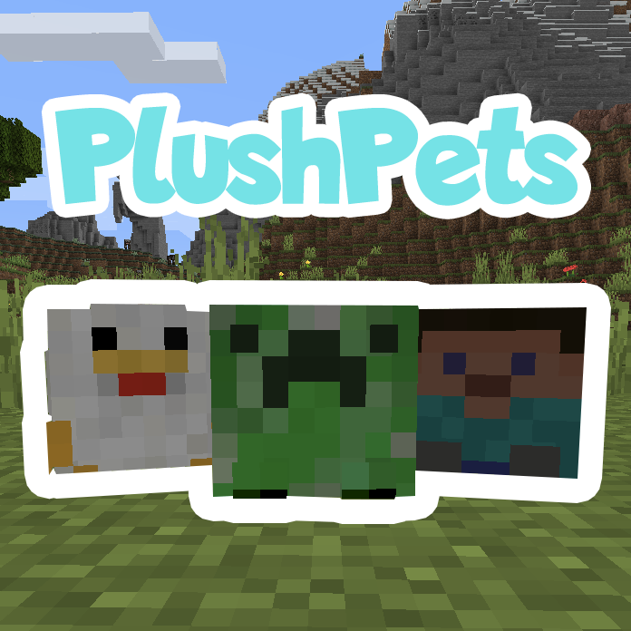

  

    <b>Animate Plushes Into Pets!</b>

    
    

    
    &nbsp;&nbsp;
    
    &nbsp;&nbsp;
    

 

 

 

 

This pack adds Plushes that can be found as loot in chests. They can be placed and picked up like Player Heads. You can "animate" them and turn them into your pet. As a pet, you can make them sit or follow, as well as breed them. There are around 40 plushes in the pack currently!

<em>
This Datapack is compatible with Datapacks that edit vanilla loot tables. It does not edit any loot table directly. It inserts the plushes into chests when players open them. This means that plushes can show up in chests with loot added from other packs!
</em>

 
 

<h3>
 <strong>
 Finding Plushes
 </strong>
</h3>

Plushes show up in all kinds of loot chests. You can find different plushes in different types of chests depending on the structure, the biome, etc.

 

 

<h3>
 <strong>
Animating Plush Pets
 </strong>
</h3>

You can "animate" a placed plush into a plush pet by applying a Weakness Potion to it, and then giving it a Glistering Melon Slice. You can make your Plush Pet sit or follow you by right-clicking it.

 

 

<h3>
 <strong>
Breeding Plush Pets
 </strong>
</h3>

Plush Pets love Feathers. They will follow you closely when you hold them. Use it to breed two Plush Pets together.

 

Plush Eggs hatch within 10 minutes. The Plush that emerges will be one of the two parents.

 

Very rarely, Plush Pets will lay a Golden Plush Egg, which will hatch into a special Golden Plush.

 

 

<h3>
 <strong>
Naming Plush Pets
 </strong>
</h3>

<em>
(1.16.2+ Only)
</em>

Right-click a Plush Pet with a renamed Name Tag to name it.

 

 

<h3>
 <strong>
 Options
 </strong>
</h3>

You can toggle features of the pack by running commands like:

 <code>
 /function plushpets:options/<option name here>
 </code>

<ul>
 <li>
Anti-Grief: Stops Plushes from dying by fire/lava. (You can still remove your plushes by right-clicking them with a flint-and-steel)
</li>
 <li>
No Breeding: Turns off the breeding mechanic.
</li>
 <li>
No Loot: Turns off Plushes spawning in loot.
</li>
 <li>
No Animating: Turns off Plush Blocks being able to be turned into pets.
</li>
 <li>
Allow Non-Plush Pets: Allows players to animate Player Heads that aren't considered Plushes.
</li>
 <li>
Uninstall: Removes the entire pack from your world. (If pets are in unloaded chunks it may not remove them.)
</li>
</ul>

 

 

    
    &nbsp;&nbsp;
    

DanMizu&copy;

